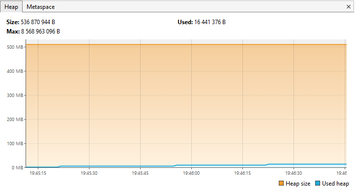

# Задача 1
Для исследования дан код:
```java
public class JvmComprehension {

    public static void main(String[] args) {
        int i = 1;                      // 1
        Object o = new Object();        // 2
        Integer ii = 2;                 // 3
        printAll(o, i, ii);             // 4
        System.out.println("finished"); // 7
    }

    private static void printAll(Object o, int i, Integer ii) {
        Integer uselessVar = 700;                   // 5
        System.out.println(o.toString() + i + ii);  // 6
    }
}
   ```
В первую очередь _Application ClassLoader_ загружает данные о классе `JvmComprehension` в область памяти Metaspace. Загружается имя, методы и прочая информация о классе. Затем _Platform ClassLoader_ и _Bootstrap ClassLoader_ производят загрузку стандартных классов Java Development Kit `Object`, `Integer` и `String` из библиотек.
После верификации и инициализации в стэке создаётся фрейм метода `main`, после чего начинается исполнение кода.
```java
int i = 1;
```
В фрейм загружается целочисленная переменная `i` со значением 1.
```java
Object o = new Object();
```
В области памяти _heap_ создаётся экземпляр `o` класса `Object`. В фрейм метода `main` добавляется ссылка на данный экземпляр.
```java
Integer ii = 2;
```
В области памяти _heap_ создаётся экземпляр `ii` класса `Integer` со значением 2. В фрейм метода `main` добавляется ссылка на данный экземпляр.
```java
printAll(o, i, ii);
```
В стэке создаётся фрейм метода `printAll`. В этом фрейме объявляется переменная `i`, которой присваивается переданное параметром значение 1, а также передаются ссылки на экземпляры `o` и `ii`, находящиеся в _heap_.
```java
Integer uselessVar = 700;
```
В области памяти _heap_ создаётся экземпляр `uselessVar` класса `Integer` со значением 700. В фрейм метода `printAll` добавляется ссылка на данный экземпляр.
```java
System.out.println(o.toString() + i + ii);
```
Для метода `println` создаётся отдельный фрейм в стэке, а в этом фрейме создаётся ссылка на поле `out` класса `System`, под содержимое которого выделяется память в _heap_. В Metaspace загружаются (если не были загружены ранее) данные о классе `PrintStream`, от которого наследуется метод `println`. Затем у экземпляра `o` вызывается метод `toString`, под который в стэке создаётся отдельный фрейм, куда помещается ссылка на строку с результатом работы метода. Для переменной `i` и экземпляра `ii` также запускается метод `.toString` класса `Integer` в собственных фреймах, где в результате создаются соответствующие строки. После чего три полученные строки конкатенируются, а ссылка на результат передаётся в поле `out`. Работа метода `println` связана с с методами классов `OutputStreamWriter`, `BufferedWriter`, `BufferedOutputStream` и их родительскими абстрактными классами.
```java
System.out.println("finished");
```
Для этого метода `println` также создаётся отдельный фрейм в стэке, а в поле `out` передаётся строка "finished". Метод работает аналогично описанному ранее.

В процессе выполнения программа занимает не более 16 МБ оперативной памяти, поэтому при выделенном объёме _heap_ в размере около 500 МБ вызов сборщика мусора не производится.
